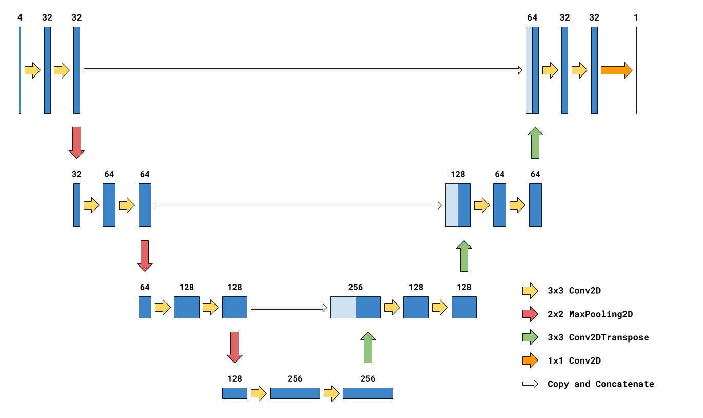

# Brain Tumor Segmentation Task
In this project, an advanced Tumor Segmentation model will be trarained that will perform tumor segmentation. 

Automatic brain tumor segmentation from magnetic resonance imaging (MRI) scans would be of great help assisting or completely replacing labor-intensive and resource-expensive manual segmentation by neurologists. However, the task is challenging due to variability in location, shape and appearance of tumors between patients. Additionally, MRI images vary greatly when obtained with different scanners.
 
We will be implementing and training segmentation model based on [U-Net architecture](https://arxiv.org/abs/1505.04597).
 

Using a small version of U-Net with the architecture scheme depicted below. The U-Net has obtained its name from having U-shaped architecture when drawn like that. If you draw an imaginary vertical line through the center of the scheme, the left part would be a contracting path and right part would be an expansive path.

## Approach Summarized
The approach to build the Tumor Segmentation Model will be achieved in the following 5 steps:

1. Patching of Features and Labels
2. Generating Meta-Data for Patches (patch number -- tumor indicator)
3. Using indices from point 2, subsample the batch data to one of these shapes (tumor VS healthy):
4. Training the Model on Base task -- the generated image patches
5. Transfer Learning : Using the weights from step 4, train the model on the main task -- prediction of tumor masks from initial input images

You will then need to generate predictions on the test set and we will assess model performance based on average patient-wise [dice coefficient](https://en.wikipedia.org/wiki/S%C3%B8rensen%E2%80%93Dice_coefficient) between your predictions and ground truth labels.

We to train a robust and generalizable model and  provide explanation for the  solution in terms of design choices and insights you gain during exploration and training. 

